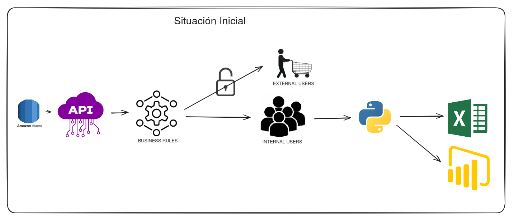
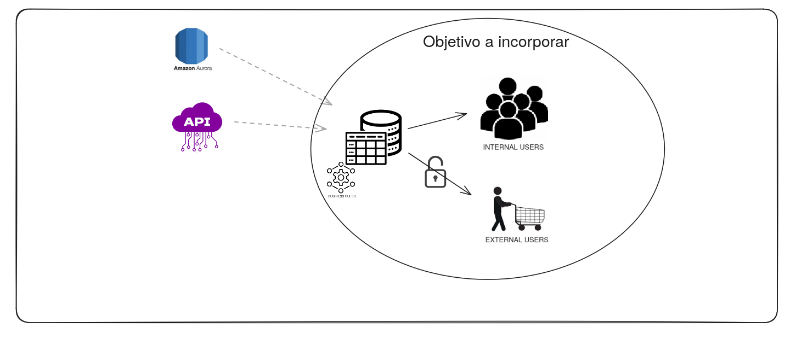
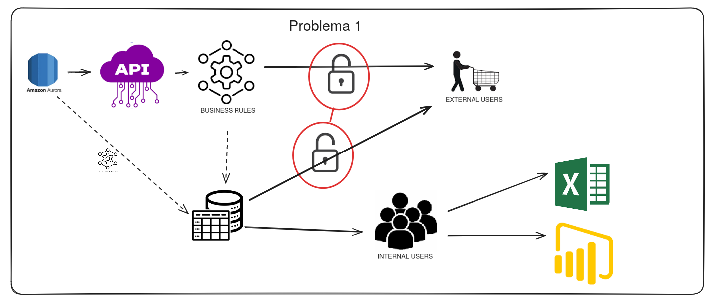
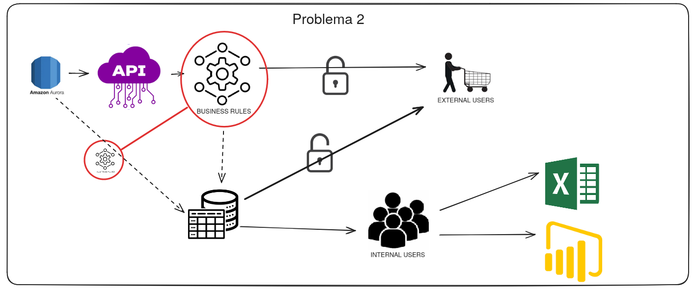
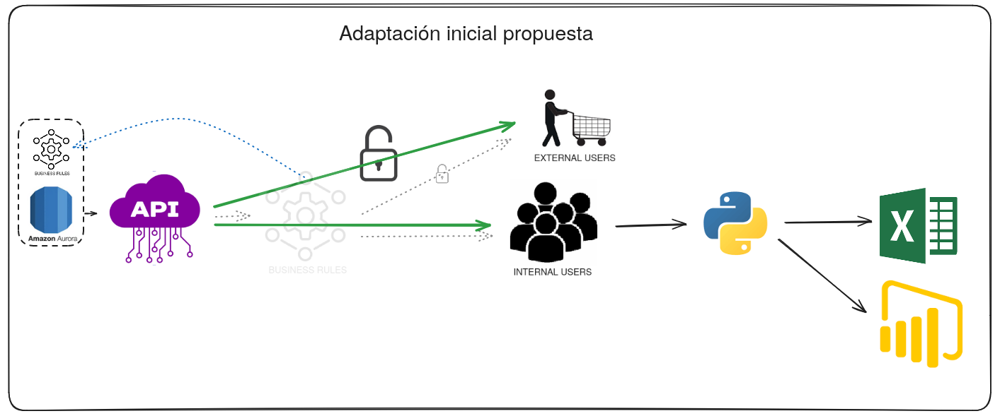
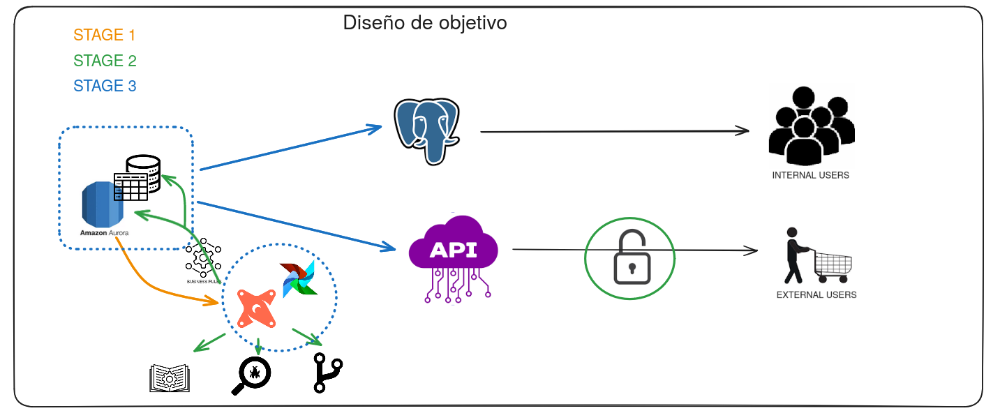
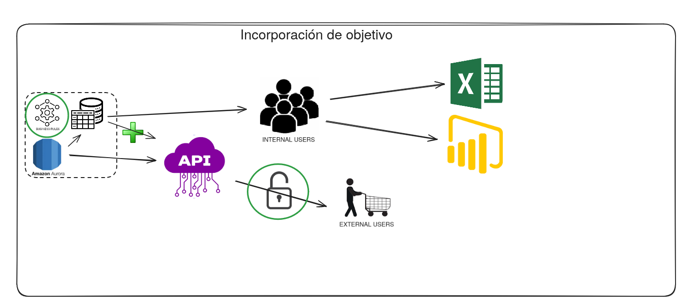

# EJERCICIO 2

### Premisa:
- Base de datos relacional en AWS (asumimos Amazon Aurora en RDS).
- Ésta base de datos sirve de fuente a una Rest API pública.
- La API pública aplica procesamiento y lógicas de negocio al vuelo cuando recibe peticiones.
- El modelo de datos existente no es apto para consumo analítico.

**Objetivo**: hacer éstos datos disponibles en un formato adecuado para analítica a usuarios internos y externos, y teniendo aplicadas las reglas de negocio.
  

**Consideraciones**:
- La información expuesta por nuestra solución va a ser la misma que expone la API, por lo que deberemos garantizar la congruencia entre esas dos fuentes de datos.
- La información en la BBDD contiene datos de todos nuestros usuarios. La API gestiona el control de acceso de dichos usuarios. Dado que los datos modelados por nuestra solución se sirven a usuarios externos, debemos garantizar la correcta aplicación de políticas de acceso y permisos de manera consistente con la API.
- Los consumidores internos de nuestra solución pueden requerir datos correspondientes a todos los usuarios externos (es decir, datos globales, sin filtrar).

Tener como objetivo la exposición de una base de datos relacional a usuarios externos que tienen a su vez acceso a una API pública que expone la misma información supone un punto de partida comprometido, dado que deberemos replicar las políticas de control de acceso (Problema 1), y la aplicación de reglas de negocio que de por sí está llevando a cabo la API (Problema 2). Ello va a suponer tanto un coste puntual en desarrollo, como un coste continuo en computación (tanto por la duplicación de trabajo al replicar procesos, como por asumir la computación y el tráfico de las consultas de consumidores externos), mantenimiento (cada cambio en políticas o reglas de negocio ha de ser aplicado en ambos sistemas), y nos expondrá a inconsistencias entre la implementación de dichas políticas y reglas entre ambos sistemas.

Si he entendido bien la premisa del problema, la API provee actualmente de acceso a datos en un formato poco amigable para la analítica (presumiblemente con un alto nivel de normalización, y máxima granularidad). Dado que una API con un diseño robusto me parece la mejor manera de exponer información externamente (por el grado de control que nos proporciona en cuanto a accesos y quotas de uso) mi propuesta consistiría en:
1. Adaptar el diseño de los sistemas existentes de manera que las reglas de negocio se apliquen dentro de la BBDD original, y no durante las requests a la API.
2. Desarrollar un modelo de datos sobre la BBDD original que dé como resultado un esquema relacional consumible por herramientas analíticas.
3. Extender la API con nuevos endpoints que expongan las tablas producidas por nuestro modelo relacional.

Bajo éste sistema, las relgas de negocio se aplicarían una sola vez (optimizando costes y garantizando consistencia), consumidores internos podrían consultar directamente el esquema relacional sin filtrar, y consumidores externos podrían volcar la información ofrecida por los API endpoints correspondientes a nuestro esquema relacional en sus propias bases de datos. Además, la responsividad de la API se vería mejorada y el coste por request reducido, dado que ya no llevarían sujeta la carga de trabajo que conlleva aplicar las reglas de negocio.

Extender la API en lugar de desarrollar un segundo sistema adicional nos proporciona una Single Source of Truth en la base de datos original, nos libera de la necesidad de replicar y mantener controles de acceso en nuestra base de datos analítica, y nos provee de un diseño más escalable y económicamente viable, dado que según nuestro número de consumidores crece, la carga computacional sobre una base de datos relacional puede dispararse de manera rápida y difícil de solventar, e incluso afectar a la disponibilidad de nuestra API.

He planteado el diseño de la solución como un proyecto de modelado desarrollado en dbt y orquestrado con Airflow.
Ambas tecnologías tienen amplia presencia en la industria y disponen de soluciones autoalojables de código abierto, evitando así la posibilidad de vendor lock-in en un determinado proveedor cloud, y eliminando el coste y complejidad de gestionar licencias.
Airflow nos permite programar la ejecución de nuestras tareas de manera extremadamente flexible, y dbt nos empuja al seguimiento de buenas prácticas mediante la generación de documentación, testing automático, trazabilidad de cambios mediante control de versiones con Git, y la segregación entre entornos de desarrollo y producción.
El resultado de éste trabajo de modelado deberá replicarse en una segunda base de datos relacional (PostgreSQL en el ejemplo) para separar la carga de trabajo generada por consultas arbitrarias desde sistemas de BI y usuarios internos.

Dado que tanto PostgreSQL, como Airflow, como dbt en su versión Core son software gratuito de código abierto, y que estaríamos aprovechando la base de datos y API originales, el coste de nuestra solución se podría ver limitado a:
- 1 instancia t3.large en eu-central-1 (2.304 dólares/día o 650.87 dólares/año con compromiso anual).
- 1 instancia PostgreSQL RDS db.t4g.medium (variable según carga de trabajo) en eu-central-1 (1.78 dólares/día).

